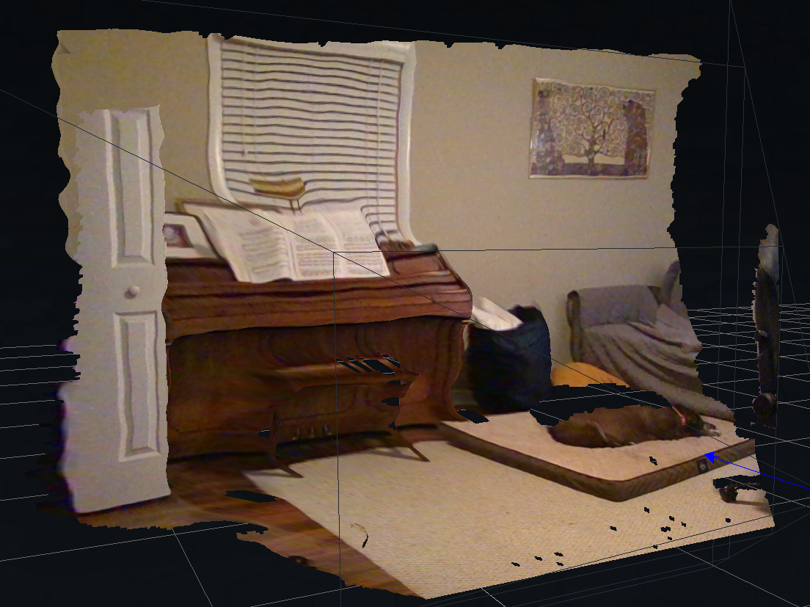
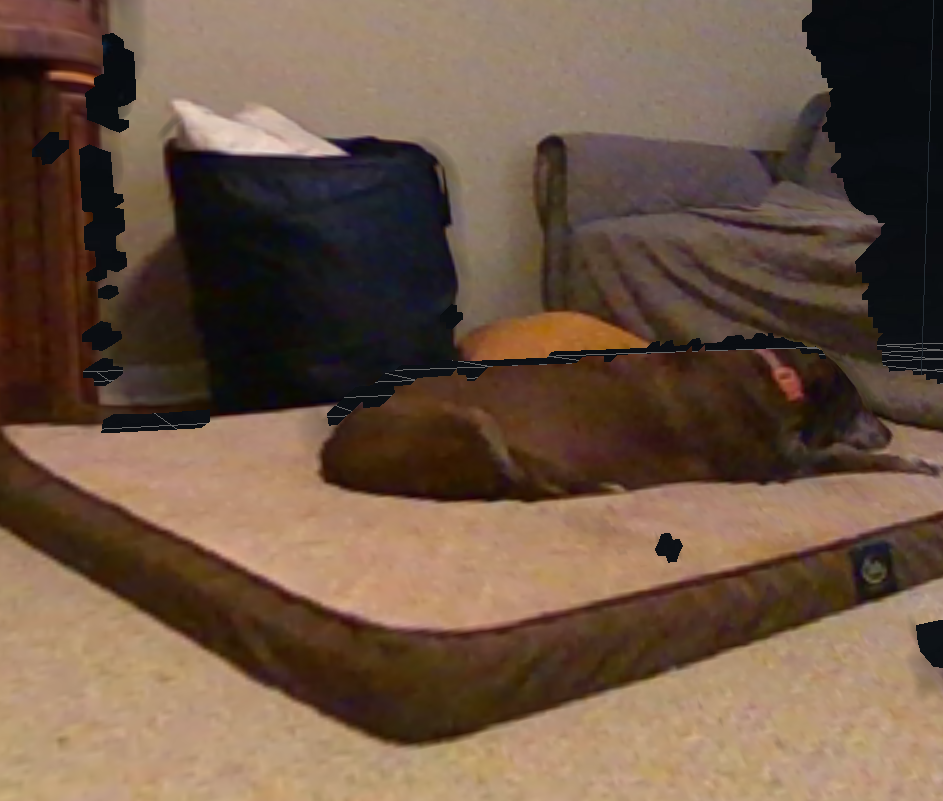

# intelrealsense

## simple guide to using Intel realsense camera in docker

## list of sensors

- Intel Realsense d435i - RGBD Camera - tested
- Intel Realsense d455  - RGBD Camera - tested

## Docker + docker compose

The Dockerfile is built from `ubuntu:focal` and follows the `distribution_linux` installation instructions [here](https://github.com/IntelRealSense/librealsense/blob/master/doc/distribution_linux.md)

Set the home directory for the container to this directory 
```
export RS_WS_PATH=$PWD
```

allow access to graphics
```
xhost local:root
```

bring up the project and build the image, this will also start the realsense-viewer 
```
docker compose up --build --remove-orphans
```

after the image is built it can be run as a service from the `docker-compose.yaml` file
```
docker compose run realsense-viewer
```

close when you done, if you want to ;)
```
docker compose down
```

 


## building realsense from source 
this steps are akwards, this needs to be contained in the dockerfile, for now this is just a proof of concept

  1) build the image using the source dockerfile, the realsense build steps 1,2,3 are completed
  ```
  docker compose up --build
  ```

  2) start the container and run bash (bash is command in docker compose)
  ```
  docker compose run realsense-source
  ```
   
in the container run the commands from the realsense instructions for the remaining steps starting at 4
  ```
  cd $RS_WS/librealsense && ./scripts/patch-realsense-ubuntu-lts-hwe.sh
  ```

the patch is the problematic step, the interactive inputs need to be handled..

it seems to work if you respond with a `-R` then a `y` but I am a little confused about this part

it looks like this when it works:
```

Resetting local changes in ubuntu-focal folder
 HEAD is now at 7d1a53370 UBUNTU: Ubuntu-hwe-5.15-5.15.0-88.98~20.04.1
Switching to LTS tag Ubuntu-hwe-5.15-5.15.0-88.98_20.04.1
HEAD is now at 7d1a53370 UBUNTU: Ubuntu-hwe-5.15-5.15.0-88.98~20.04.1
Applying patches for focal-hwe-5.15 line
Applying realsense-uvc patch
patching file drivers/media/usb/uvc/uvc_driver.c
patching file drivers/media/usb/uvc/uvcvideo.h
patching file drivers/media/v4l2-core/v4l2-ioctl.c
patching file include/uapi/linux/videodev2.h
Applying realsense-metadata patch
patching file drivers/media/usb/uvc/uvc_driver.c
Hunk #1 succeeded at 3215 (offset 51 lines).
patching file drivers/media/usb/uvc/uvcvideo.h
Hunk #1 succeeded at 221 (offset 34 lines).
Applying realsense-hid patch
patching file drivers/iio/accel/hid-sensor-accel-3d.c
Reversed (or previously applied) patch detected!  Assume -R? [n] -R
Apply anyway? [n] y
Hunk #1 FAILED at 280.
1 out of 1 hunk FAILED -- saving rejects to file drivers/iio/accel/hid-sensor-accel-3d.c.rej
patching file drivers/iio/gyro/hid-sensor-gyro-3d.c
Reversed (or previously applied) patch detected!  Assume -R? [n] -R
Apply anyway? [n] y
Hunk #1 FAILED at 231.
1 out of 1 hunk FAILED -- saving rejects to file drivers/iio/gyro/hid-sensor-gyro-3d.c.rej
patching file drivers/iio/accel/hid-sensor-accel-3d.c
Reversed (or previously applied) patch detected!  Assume -R? [n] -R
Apply anyway? [n] y
Hunk #1 FAILED at 276.
1 out of 1 hunk FAILED -- saving rejects to file drivers/iio/accel/hid-sensor-accel-3d.c.rej
patching file drivers/iio/gyro/hid-sensor-gyro-3d.c
Hunk #1 FAILED at 29.
Hunk #2 FAILED at 74.
Hunk #3 FAILED at 181.
Hunk #4 FAILED at 197.
Hunk #5 succeeded at 233 with fuzz 1 (offset 8 lines).
4 out of 5 hunks FAILED -- saving rejects to file drivers/iio/gyro/hid-sensor-gyro-3d.c.rej
```

now build the package

```
mkdir build && cd build

cmake ../ -DBUILD_EXAMPLES=true

```

and finally make, use the -jX flag to choose number of cores
```
make uninstall && make clean && make -j12 && make install
```
for some reason, i think j12 was intepretted as 16


after that runs librealsense is ready, however, the camera needed to be unplugged during that time...

so we have to restart the container so that the video volumes work! agagagfag

to do this, commit the changes made in the container from a separate terminal while the container is still on like this


```
docker container ps -l
```
the you can see the container ID, next commit the changes to that container with a new name. 
i think an entire new image is created at this point

```
docker commit <CONTAINER_ID> realsense/patched
```

now you can access the updated container as realsense/patched
shut down the container that was patched

now plug in the camera and run the patched image from docker compose

```
docker compose run realsense-patched
```
inside you should be able to run the viewer with 

```
realsense-viewer
```

it still wont calibrate :(, also the motion module will not turn on :(

on the bright side, the image quality looks improved, also the USB 3.1 error/warning is gone
this was tested with the ds435i from the rover


